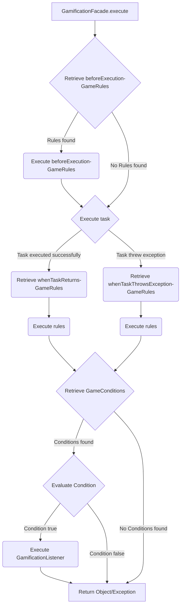
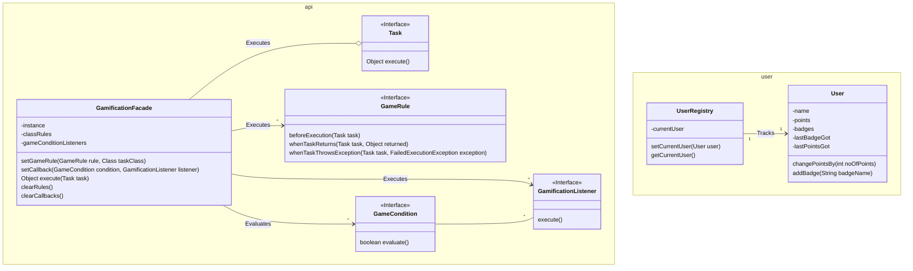

##### ssa-assignment-03
# Gamification Framework
A framework designed to apply concepts of gamification to your Java Applications.

# Index
1. Framework Description
2. Class Diagram
3. Provided Features / Implementations
4. Simple "Hello World" example
5. Framework usage examples

# 1. Framework Description
The Gamification Framework helps developers to add game-elements to their applications, providing a more entertaining user expirience.
The main idea of the Framework is to keep a score for each user and track special achievements through badges that the user can be awarded with.
The framework provides the tooling to extend the execution of tasks with game related rules.

The singleton class `GamificationFacade` handles the execution flow of tasks with connected rules and/or conditions.
The execution flow of a task is extended in this way:



The framework allows the creation of:
## 1.1 `User`
The `User` class stores information about the user that is currently using the application. The `User`-class must be instantiated and provided to the `UserRegistry` singleton-class in order to work properly.
The `UserRegistry` tracks who's the current user of the thread that the application is executed in.
A `User` has points and badges that can be read or altered using the provided methods.

## 1.2 `Task`
A `Task` is something that is executed by the `GamificationFacade` singleton-class. It may return an Object or throw a `FailedExecutionException`.

## 1.3 `GameRule`
A `GameRule` allows the creation of Rules that are connected to the task execution flow.
The rule can execute code `beforeExecution`, `whenTaskReturns` or `whenTaskThrowsException`, so whenever a task is executed, a Rule can be executed before or after a Task execution.

## 1.4 `GameCondition` and `GamificationListener`
The `GameCondition` and `GamificationListener` classes work together in the framework to allow the creation of more sophisticated rules.
These conditions apply to all Tasks and do not have to be attached to a specific task.
After a task is executed, the `GamificationFacade` iterates over all `GameCondition`s to see if any of them is true.
If a `GameCondition` is actually true, the connected `GamificationListener` is executed.
If a `GameCondition` is not `persistent`, then it is removed from the list of conditions that the `GamificationFacade` tracks, once it was evaluated to true. This essentially means that any listeners connected to this `GameCondition` are only executed once.

# 2. Class Diagram
The following diagram shows the Class Diagram of the `gamification.api`- and `gamification.user`-packages.


# 3. Provided Features / Implementations
This framework includes some example rules and listeners. Here's a small explanation of what you can expect to find.
## 3.1 `GameRule`
### 3.1.1 `AnnoyingPerson`
This rule awards the current User with the `"Annoying"` badge if they run into an exception while executing a task.

### 3.1.2 `BadgeCollector`
This rule awards the current User with the `"Badge Collector"` if they manage to collect a minimum number of badges.

### 3.1.3 `RecordPoints`
This rule awards the current User with points for each task execution, but before the task is executed.

### 3.1.4 `Roguelike`
This rule removes all points and badges from the User if they run into an exception while executing a task. 

### 3.1.5 `TrueFalseReturn`
This rule awards the current User with points based on the return value of the executed Task.
The returned Object of the Task is cast to `Boolean` and if the cast-object is true, then `pointsIfTrue` are awarded, otherwise `pointsIfFalse` are awarded instead.

## 3.2 `GameCondition`
### 3.2.1 `BadgeCollected`
This condition compares the last gained badge with the provided `badgeName`. The condition returns true only if they match.
This condition is not persistent.

### 3.2.2 `PointsWon`
This condition compares the last gained points with the provided `minimumNoOfPoints`. The condition returns true if the last gained points are greater or equal to `minimumNoOfPoints`.
This condition is not persistent.

### 3.2.3 `PointsCollected`
This condition compares the current User's points with the provided `minimumNoOfPoints`. The condition returns true if the current User's points are greater or equal to `minimumNoOfPoints`.

## 3.3 `Gamificationlistener`
### 3.3.1 `ChangePoints`
This listener changes the points of the current User. The provided `pointsToAdd` are added to the current Users points.

### 3.3.1 `CongratulateUserInConsole`
This listener prints a `message` in the console.

# 4. Simple "Hello World" example
Here's a very simple example of how you could use the Gamification Framework in a "Hello World"-application.
```java
public class PrintTextTask implements Task {
    private String textToPrint;

    public PrintTextTask(String textToPrint) {
        this.textToPrint = textToPrint;
    }

    @Override
    public Object execute() throws FailedExecutionException {
        System.out.println(textToPrint);
        return null;    // The return value does not matter for this example
    }
}

public class GamificationMain {
    public static void main(String[] args) {
        // Create and set a User as the current User
        User user = new User("example_username");
        UserRegistry.setCurrentUser(user);

        // Configure the Game Rules for the Application
        // rule1 awards 1 point for each Task execution
        GameRule rule1 = new RecordPoints(1);

        // Apply the Game Rules to a Task-class
        // rule1 applies to any executions of the PrintTextTask.
        GamificationFacade.getInstance().setGameRule(rule1,PrintTextTask.class);

        // Execute the PrintTextTask
        try {
            GamificationFacade.getInstance().execute(new PrintTextTask("Hello World!"));
        } catch (FailedExecutionException ex) {
            System.out.println("Something went wrong.");
        }

        System.out.println("User has now " + UserRegistry.getCurrentUser().getPoints() + " Point(s).");
    }
}
```

This example will print:
```
Hello World!
User has now 1 Point(s).
```

You can find the full source code in the provided `GamificationHelloWorld`-Module.

# 5. Framework usage examples
## 5.1 Example of multiple Rules connected to a Task
This example connects two different rules to the same task. At each task execution, we see that all rules are considered.
```java
public class ReturnTrueFalseTask implements Task {
    private boolean whatIWantToReturn;
    public ReturnTrueFalseTask(boolean whatIWantToReturn) {
        this.whatIWantToReturn = whatIWantToReturn;
    }

    @Override
    public Object execute() throws FailedExecutionException {
        // this primitive boolean is automatically wrapped in
        // the Boolean-class.
        return whatIWantToReturn;
    }
}

public class MultipleRulesForATaskMain {
    public static void main(String[] args) {
        // Create and set a User as the current User
        User user = new User("example_username");
        UserRegistry.setCurrentUser(user);

        // Configure the Game Rules for the Application
        // rule1 awards 1 point for each Task execution
        GameRule rule1 = new RecordPoints(1);
        // rule2 awards 5 points for each Task that returns true, and removes 1 point for each Task that returns false.
        GameRule rule2 = new TrueFalseReturn(5,-1);

        // Apply the Game Rules to a Task-class
        // rule1 applies to any executions of the PrintTextTask.
        GamificationFacade.getInstance().setGameRule(rule1, ReturnTrueFalseTask.class);
        GamificationFacade.getInstance().setGameRule(rule2, ReturnTrueFalseTask.class);

        // Execute the ReturnTrueFalseTask
        try {
            for(int i = 0; i < 6; i++) {
                GamificationFacade.getInstance().execute(new ReturnTrueFalseTask(i < 4));
                System.out.println("User has now " + UserRegistry.getCurrentUser().getPoints() + " Point(s).");
            }
        } catch (FailedExecutionException ex) {
            System.out.println("Something went wrong.");
        }
    }
}
```
The output of the code above will be:

```
User has now 6 Point(s).
User has now 12 Point(s).
User has now 18 Point(s).
User has now 24 Point(s).
User has now 24 Point(s).
User has now 24 Point(s).
```

## 5.2 Example of Game Condition connected to a Task
The following example shows how you can assign Conditions and Listeners to the `GamificationFacade` singleton.
These conditions and listeners are valid for all tasks and are not specified for a specific class.
```java
public class ReturnTrueFalseTask implements Task {
    private boolean whatIWantToReturn;
    public ReturnTrueFalseTask(boolean whatIWantToReturn) {
        this.whatIWantToReturn = whatIWantToReturn;
    }

    @Override
    public Object execute() throws FailedExecutionException {
        // this primitive boolean is automatically wrapped in
        // the Boolean-class.
        return whatIWantToReturn;
    }
}

public class GameConditionForATaskMain {
    public static void main(String[] args) {
        // Create and set a User as the current User
        User user = new User("example_username");
        UserRegistry.setCurrentUser(user);

        // Configure the Game Rules for the Application
        // Configure basic rule, which gives 5 points per Task execution
        GameRule rule = new RecordPoints(5);
        GamificationFacade.getInstance().setGameRule(rule, ReturnTrueFalseTask.class);

        // Configure Callback Condition
        // condition results in "true" only if the User just received at least 5 points
        // Note that PointsWon is not persistent, therefore it will be executed only once!
        GameCondition condition = new PointsWon(5);
        // listener adds 2 to the current User's points
        GamificationListener listener = new ChangePoints(2);
        // assign the listener to the GamificationFacade instance. The condition holds for all types of tasks.
        GamificationFacade.getInstance().setCallback(condition,listener);

        // Execute the ReturnTrueFalseTask
        try {
            for(int i = 0; i < 3; i++) {
                GamificationFacade.getInstance().execute(new ReturnTrueFalseTask(true));
                System.out.println("User has now " + UserRegistry.getCurrentUser().getPoints() + " Point(s).");
            }
        } catch (FailedExecutionException ex) {
            System.out.println("Something went wrong.");
        }
    }
}
```

This example will output the following:
```
User has now 7 Point(s).
User has now 12 Point(s).
User has now 17 Point(s).
```
